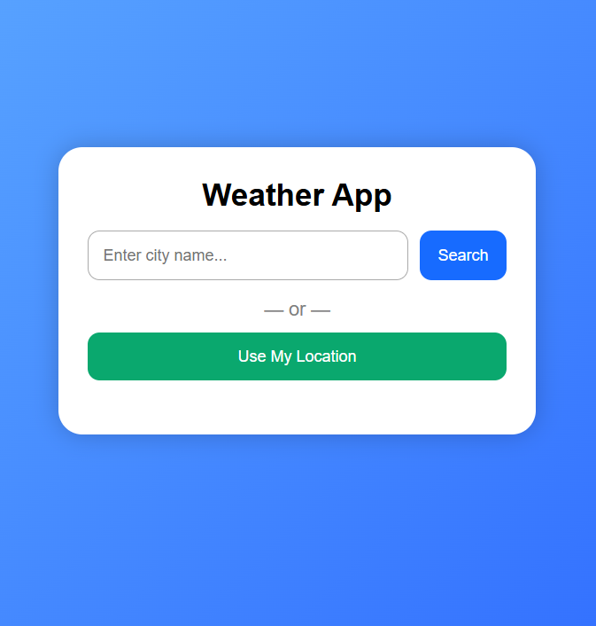
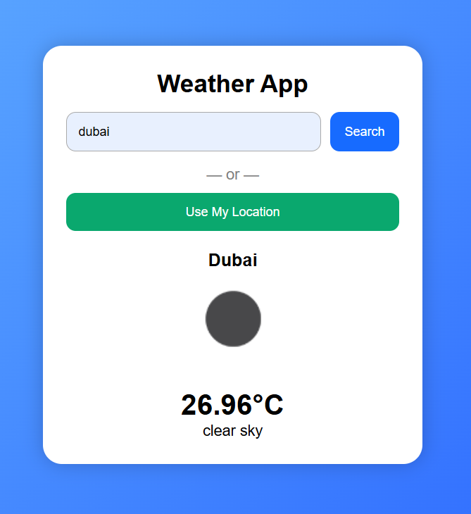

# WeatherApp

A simple and responsive weather application built using HTML, CSS, and JavaScript.  
It shows the current weather of any city with beautiful UI and animated icons.

## Features
- Search weather by city name  
- Displays temperature, humidity, and wind speed  
- Mobile responsive  
- Clean and modern UI  

## Screenshots

### Home Screen

### Location Weather

### Location Weather

### By Using Exact Location 
