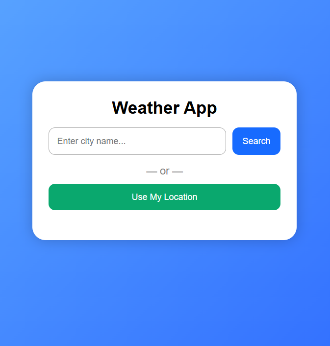
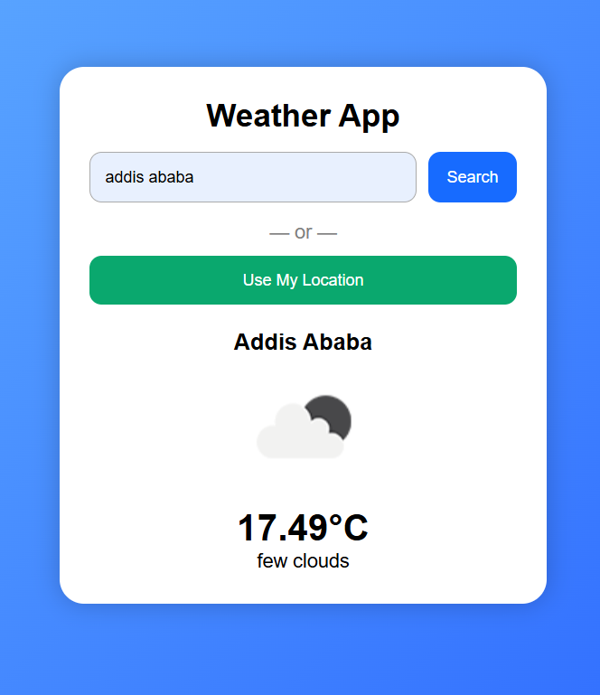
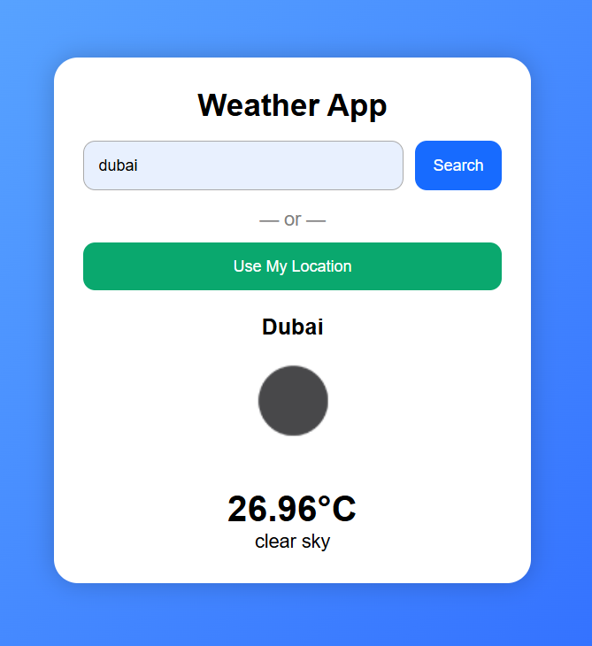
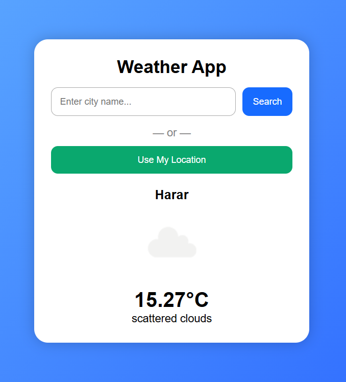

# 🌦️ Weather Application

This project is a modern, user-friendly Weather Application built with JavaScript that provides real-time weather information using the **OpenWeatherMap API**.

It allows users to quickly check current weather conditions either by entering a city name or by using their current geographic location.

---

## ✨ Features

- 🔍 Search weather by city name with autocomplete suggestions
- 📍 Get weather using current location
- 🌡️ Displays temperature, weather description, and icon
- 📱 Fully responsive design
- 🎨 Clean and modern UI with Tailwind CSS
- ⌨️ Keyboard navigation support for city suggestions

---

## 🚀 Quick Start

### Local Development

1. Clone this repository:
   ```bash
   git clone https://github.com/Naol724/WeatherApp.git
   cd WeatherApp
   ```

2. Copy `load-env.example.js` to `load-env.js`:
   ```bash
   copy load-env.example.js load-env.js
   ```

3. Open `load-env.js` and replace `YOUR_API_KEY_HERE` with your OpenWeatherMap API key

4. Open `index.html` in your browser

### Getting an API Key

1. Visit [OpenWeatherMap](https://openweathermap.org/api)
2. Sign up for a free account
3. Generate your API key from the dashboard
4. Add it to your `load-env.js` file

---

## 🌐 Deployment

This app is ready to deploy on:

- **Render** (recommended)
- **Vercel**
- **Netlify**

See [DEPLOYMENT.md](DEPLOYMENT.md) for detailed deployment instructions.

### Quick Deploy to Render/Vercel:

1. Push code to GitHub
2. Connect your repository
3. Add environment variable:
   - **Key:** `OPENWEATHER_API_KEY`
   - **Value:** Your API key
4. Set build command: `npm run build`
5. Deploy!

---

## 📸 Screenshots

### Home Screen


### City Search - Addis Ababa


### City Search - Dubai


### Location-Based Weather


---

## 🛠️ Technologies Used

- HTML5
- CSS3 (Tailwind CSS)
- Vanilla JavaScript (ES6+)
- OpenWeatherMap API
- Geolocation API

---

## 📋 How It Works

1. **City Search**: Type a city name and get autocomplete suggestions from 50+ popular cities
2. **Location-Based**: Click "Use My Location" to get weather for your current location
3. **API Integration**: Fetches real-time weather data from OpenWeatherMap
4. **Error Handling**: Gracefully handles invalid inputs, API errors, and network issues

---

## 🎯 Project Purpose

This project demonstrates:

- ✅ External API integration
- ✅ Asynchronous JavaScript (`async/await`)
- ✅ DOM manipulation and event handling
- ✅ Geolocation API usage
- ✅ Responsive design principles
- ✅ Secure API key management
- ✅ Deployment best practices

---

## 📝 License

MIT License - feel free to use this project for learning or personal use.

---

## 👤 Author

**Naol724**
- GitHub: [@Naol724](https://github.com/Naol724)

---

## 🙏 Acknowledgments

- Weather data provided by [OpenWeatherMap](https://openweathermap.org/)
- Icons from OpenWeatherMap
- UI styling with [Tailwind CSS](https://tailwindcss.com/)

---

Made with ❤️ by Naol724
